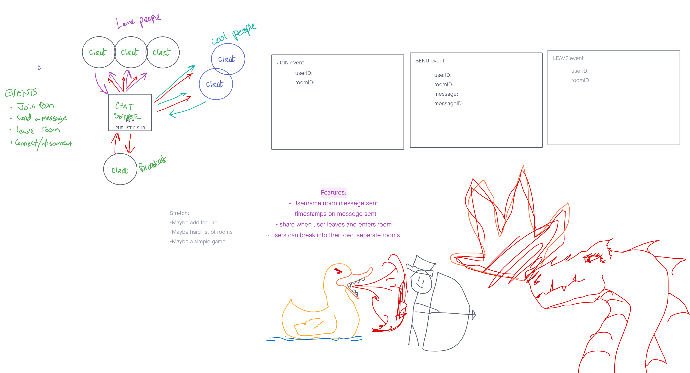

# chit-chat-rooms
An event driven instant messaging system designed to facilitate messages between multiple users in multiple rooms from a single entry point.

## GUI deploy and CLI deploy

AWS Site: http://chitchatrooms-env.eba-fhzpmdrj.us-east-2.elasticbeanstalk.com/ || 
http://chit-chat-rooms-cli-env.eba-hnmfwadp.us-east-2.elasticbeanstalk.com/

Tiara & Tanner stepped through the AWS, created a user and an environment to deploy this web application via EC2 virtual server and Elastic Beanstalk web app management. 


Deployed Site: https://lab14cashmoneychitchat.herokuapp.com/

Latest Pull Request: https://github.com/the-dragon-group/chit-chat-rooms/pull/2


    
## Installation

1. Clone this repository onto your local machine
2. `cd` into `./chit-chat-rooms`
3. Install package dependencies with `npm install`
4. Run server with `npm start`
5. Access chat client via browser at server's address.  
    
NOTE: Query parameters **must** be included in the url indicating the userID and roomID, as in the below example:
```
http://localhost:3000?userID=<YOUR-USERNAME>&roomID=<ROOM-NAME>
```
    
Rooms and users are created as-needed.  There are no permanent rooms or users.

## Authors

* Beau Hibbert
* Micha Davis
* Tanner Percival
* Tiara Brown

